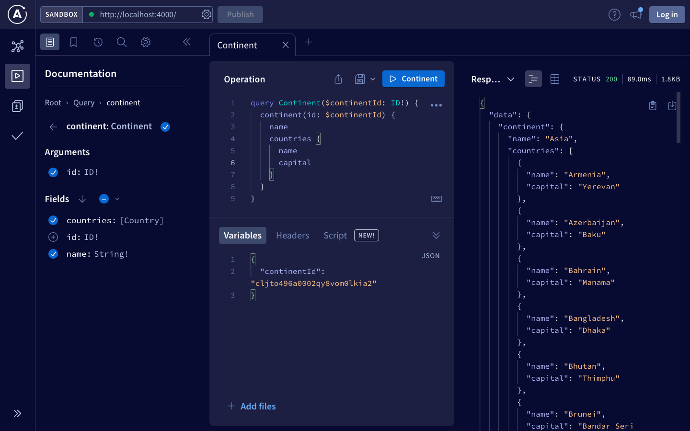
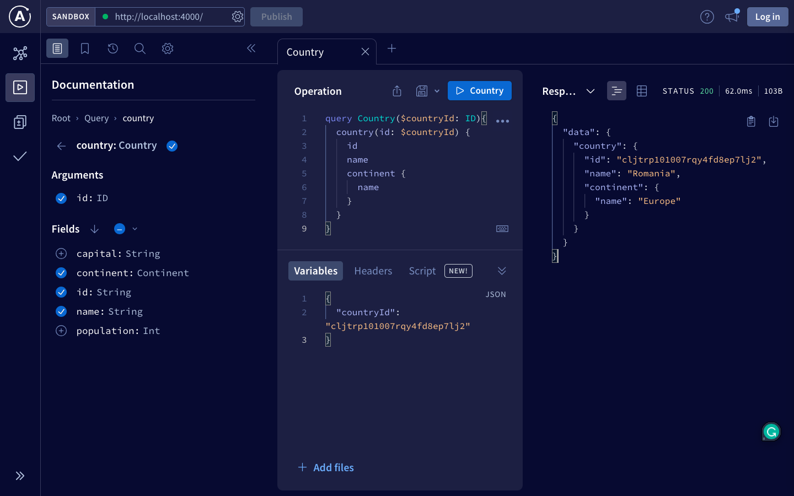

# Country GraphQL API

Hey there! Welcome aboard this mini-venture into the land of countries, languages, and continents. We're exploring these territories with the magical trio of [Prisma](https://www.prisma.io/), an incredible ORM for Node.js and TypeScript, [SQLite](https://www.sqlite.org/index.html), a compact yet formidable database engine, and [GraphQL](https://graphql.org/), a query language that's pretty much like an oracle for APIs!





## Features 📚

- Query information about continents, countries, and languages as easily as flicking through the pages of a travel magazine.
- Sail through the sea of relational data, establishing many-to-many relationships between countries and languages.
- Built on the mighty SQLite database, for rock-solid reliability.
- A fully operational and live GraphQL API that's ready for real-time querying.
- Uses Prisma ORM for an all-round smoother database management experience.

## Live API 💻

Ready for a test-drive? Take our live API for a spin at:

[Live API Link](#) <-- (Please replace with the actual URL.)

## How to Run Locally 🏃‍♀️

1. Clone the repository: `git clone https://https://github.com/AndreiChristian/CountriesGraphQL.git`
2. Navigate into the project directory: `cd yourrepository`
3. Install the dependencies: `npm install`
4. Start the server: `npm start`

Voila! You should now have the GraphQL API serving at `http://localhost:4000`.

> **NOTE: On Data Accuracy and Disclaimer**
>
> _While we strive for accuracy, we must admit that our data isn't perfect. Changes in country demographics, official languages, and continent classifications can lead to discrepancies._
>
> _The data provided by the API is for reference only and might not fit the bill for applications needing exact data. For the most accurate data, always consider checking official or government sources._
>
> _Use this API responsibly, and if you find any inaccuracies or issues, your contributions are always welcome._
>
> **Disclaimer:** _The API, its data, and its maintainers aren't liable for any damages or issues resulting from the use of the provided data. All data is provided "as is" and comes without any kind of warranty._

## Available Queries 📖

Here are some samples of the queries you can run on this API:

### Get a Single Country

```graphql
query {
  country(id: "your_country_id") {
    id
    name
    capital
    population
    continent {
      id
      name
    }
  }
}
```

### Get All Countries

This query retrieves information about all countries stored in the database.

```graphql
query {
  countries {
    id
    name
    capital
    population
    continent {
      id
      name
    }
  }
}
```

### Get a Single Language

Fetches information about a single language. Replace "your_language_id" with the ID of the language you want to query.

```graphql
query {
  language(id: "your_language_id") {
    id
    name
  }
}
```

### Get All Languages

This query retrieves information about all languages in the database.

```graphql
query {
  languages {
    id
    name
  }
}
```

### Get One Continent

Fetches information about a single continent and its related countries. Replace "your_continent_id" with the ID of the continent you want to query.

```graphql
query {
  continent(id: "your_continent_id") {
    id
    name
    countries {
      id
      name
    }
  }
}
```

### Get One Continent

This query retrieves information about all continents and their related countries in the database.

```graphql
query {
  continents {
    id
    name
    countries {
      id
      name
    }
  }
}
```

### Contributing 🖖

Your contributions are always welcome! Spot a bug, have an idea for a feature, or found something we could do better? Feel free to open an issue or send a pull request. Every bit of help counts!

_P.S. A good sense of humor is always appreciated!_
